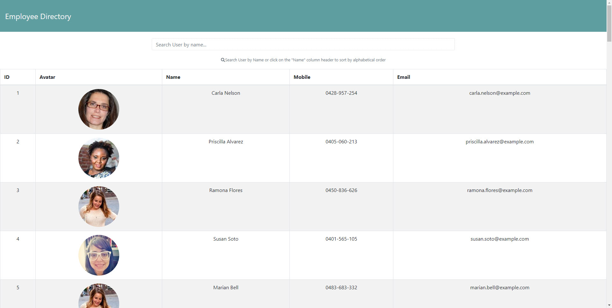
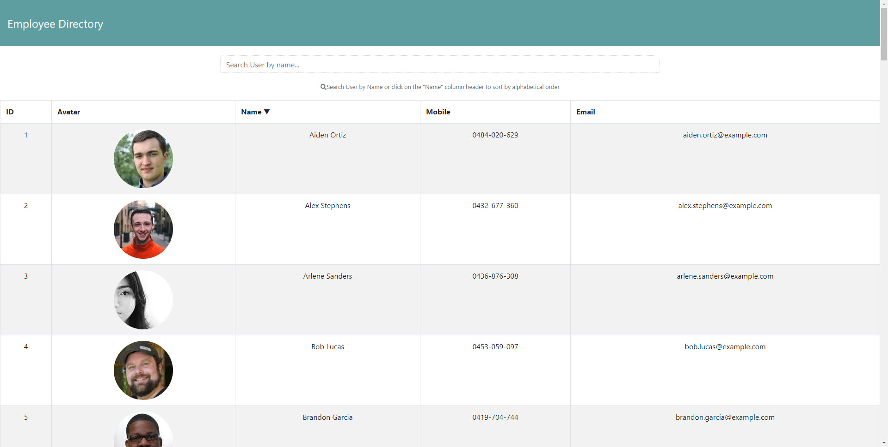
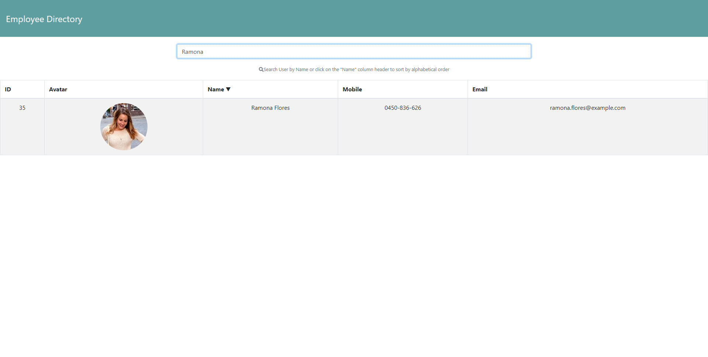

# MBC-Employee-Directory

## Application & Repository Link

###### [Application Link]()

###### [Repository Link](https://github.com/Suji-GitH/MBC-Employee-Directory)

## Content
- [Overview](#Overview)
- [Acceptance Criteria](#Acceptance-Criteria)
- [Application Screens](#Application-Screens)
- [Installation](#Installation)
- [Credits](#Credits)

## Overview

```
An employee or manager would benefit greatly from being able to view non-sensitive data about other employees. It would be particularly helpful to be able to filter employees by name.

User Story:
As a user, I want to be able to view my entire employee directory at once so that I have quick access to their information.
```

## Acceptance Criteria

Given a table of random users, when the user loads the page, a table of employees should render. 

The user should be able to:

  * Sort the table by at least one category

  * Filter the users by at least one property.

## Installation

1. Download/Clone this GitHub repository.
2. Install dependencies via npm i. 
3. Run the app through node.js by npm start.

## Application-Screens

###### App Screenshots

Landing Page


Sort by Alphabetical 


Search Specific User


## Credits

- Heroku
- React
- node.js
- Randomuser.me API
- Reactstrap
- FontAwesome
